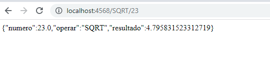
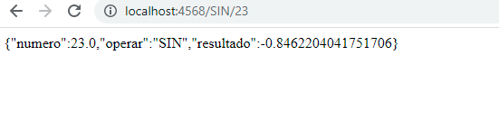
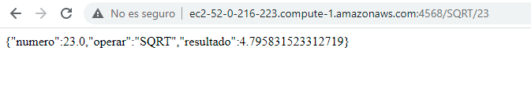

"# Servicios"

Se implementaron las funciones sin y sqrt en donde
reciven la funcion y el numero y retorna el resultado

AWS
 para correr en ec2 corremos el siguiente comando java -cp "target/classes:target/dependency/*" edu.escuelaing.arem.App

y probamos un ejemplo

